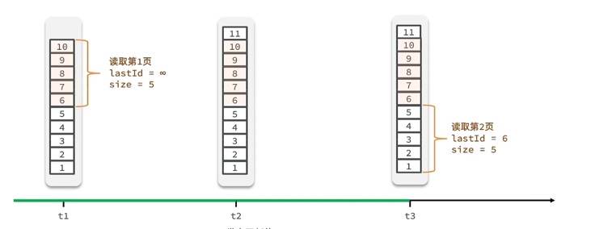

# feed demo

## 接口文档地址
<https://apifox.com/apidoc/shared-d1ef64d0-3d7e-44cc-b976-ed2c4717268e>

## 1.项目介绍
Feed：Feed流中每一条状态或者是消息都是Feed，比如朋友圈中的一个状态就是一个Feed，微博中的一条微博就是Feed。

Feed流：持续更新并呈现给用户内容的信息流。每个人的朋友圈，微博关注页面也都是一个Feed流。

Timeline：Timeline其实是一种Feed流的类型，微博，朋友圈其实都是Timeline类型的Feed流，但是由于Timeline类型出现最早，使用最广泛，最为人熟知，因此也用Timeline来表示Feed流。

关注页Feed流：展示其他人的Feed消息的页面，比如朋友圈、微博首页等。

个人页Feed流：展示自己所发布的Feed消息的页面，比如微信中的相册、微博个人页等。

主页Feed流：展示平台所有用户的Feed流，随机推荐，比如抖音主页。

## 2.项目分析

* **Feed分类**
  Feed流的分类有很多种，但最常见的分类有两种:

* **Timeline：按发布的时间顺序排序，先发布的先看到，后发布的排列在最顶端，类似于微信朋友圈，微博等。这也是一种最常见的形式。产品如果选择Timeline类型，那么就是认为**`Feed流中的Feed不多，但是每个Feed都很重要，都需要用户看到。`
* Rank：按某个非时间的因子排序，一般是按照用户的喜好度排序，用户最喜欢的排在最前面，次喜欢的排在后面。这种一般假定用户可能看到的Feed非常多，而用户花费在这里的时间有限，那么就为用户选择出用户最想看的Top N结果，场景的应用场景有图片分享、新闻推荐类、商品推荐等。
* **Feed存储方案**
  因为该项目中Feed比较简单，就类比于空间说说，因此可以使用MySQL关系型数据库存储，如果对于数据结构比较复杂的Feed流就要使用NoSQL数据库，这样存储更方便与高效，比如MongoDB或者HBase。

本项目的feed流均为文本，相对比较简单，采用MySQL+Redis进行搭配存储。

* Feed流推送方案
  在推送方案里面的，有三种方案，分别是:

* 拉方案：也称为`读扩散`，用户主动去拉取关注人的Feed内容。
* **推方案：也成为**`写扩散`**，当用户添加Feed时，会自动将Feed通知给关注的人(优选)，使用Redis Sorted Sets(方便按时间排序Timeline）维护粉丝的Feed集合，当博主添加Feed时，主动将内容推送到粉丝集合中，这样用户可以很方便快速从集合中读取。**
* 推拉结合：比如微博，大部分用户的账号关系都是几百个，但是有个别用户是1000万以上才使用。（项目用户量比较大时适合）。

## 3.项目实现

**项目的数据库设计**

```sql
-- User表
CREATE TABLE `users`
(
    `id`             bigint(0) NOT NULL AUTO_INCREMENT COMMENT 'PK',
    `username`       varchar(32)  NOT NULL,
    `password`       varchar(200)  NULL DEFAULT NULL,
    `follow_count`   bigint(0)  NULL DEFAULT 0,
    `follower_count` bigint(0)  NULL DEFAULT 0,
    `avatar` varchar(255) DEFAULT NULL COMMENT '头像链接',
    PRIMARY KEY (`id`)
);
ALTER TABLE `feed`.`users`
    ADD UNIQUE INDEX `username&password`(`username`, `password`) USING BTREE COMMENT 'username+password的唯一组合索引';


-- 关注表
CREATE TABLE `relations`
(
    `id`           bigint(0) NOT NULL AUTO_INCREMENT,
    `user_id`      bigint(0) NULL DEFAULT 0,
    `following_id` bigint(0) NULL DEFAULT 0,
    PRIMARY KEY (`id`)
);
ALTER TABLE `feed`.`relations`
    ADD UNIQUE INDEX `user_follow`(`user_id`, `following_id`) USING BTREE COMMENT '关注着和被关注者的id构成唯一索引';

-- 博文表
CREATE TABLE `blogs`
(
    `id`             bigint(0) NOT NULL AUTO_INCREMENT  COMMENT 'blog_id',
    `title`          varchar(128) NOT NULL DEFAULT '' COMMENT '标题',
    `content`        VARCHAR(512)  NULL DEFAULT NULL COMMENT '博文内容',
    `favorite_count` bigint(0) NULL DEFAULT 0 COMMENT '点赞量',
    `comment_count`  bigint(0) NULL DEFAULT 0 COMMENT '评论量',
    `user_id`        bigint(0) NOT NULL COMMENT 'FK reference user id',
    `top`            varchar(24) NOT NULL DEFAULT 0 COMMENT '置顶标志字段',
    `create_time`    datetime(0) NOT NULL DEFAULT CURRENT_TIMESTAMP (0),
    `update_time`    datetime(0) NOT NULL DEFAULT CURRENT_TIMESTAMP (0),
    PRIMARY KEY (`id`)
);

-- 点赞表
CREATE TABLE `favorites`
(
    `id`          bigint(0) NOT NULL AUTO_INCREMENT,
    `user_id`     bigint(0) NOT NULL,
    `blog_id`     bigint(0) NOT NULL,
    `is_favorite` tinyint(0) NULL DEFAULT 0,
    PRIMARY KEY (`id`)
);
ALTER TABLE `feed`.`favorites`
    ADD UNIQUE INDEX `user_blog`(`user_id`, `blog_id`) USING BTREE COMMENT 'user_id+blog_id的唯一索引';


-- 评论表
CREATE TABLE `comments`
(
    `id`          bigint(0) NOT NULL AUTO_INCREMENT,
    `user_id`     bigint(0) NOT NULL,
    `blog_id`     bigint(0) NOT NULL,
    `content`     varchar(500) DEFAULT '',
    `create_time`    datetime(0) NOT NULL DEFAULT CURRENT_TIMESTAMP (0),
    PRIMARY KEY (`id`)
);
ALTER TABLE `feed`.`comments`
    ADD INDEX `blog_id`(`blog_id`) USING BTREE COMMENT 'blogId的普通索引';
```

**项目的总体结构**


* **Redis的****Sorted Sets集合使用**

1. 存储用户个人feed集合，方便用户更快的获取个人发布的feed流信息，用户发布和删除feed时候会对于Redis存储集合进行操作。
2. 存储用户关注的所有用户发布的feed集合，自动根据发布时间作为score来进行排序，用户发布feed时会主动推送到所有粉丝的该集合内，用户关注新用户也会将所关注用户的所有feed信息存储进入集合排序。用户取关时也会将对应的取关者的feed流从该集合中去除。

* **feed流传统分页问题解决**
  
由于Feed流下数据是不断更新的，因此数据的角标也会随之变化，传统的分页模式会导致出现数据重复读的情况。


**使用滚动分页**

滚动分页的核心就是：我们需要记录每次操作的最后一条，然后从这个位置开始读取数据。

使用缓存读优化~~~~

## 项目的优化以及展望

### 优化：
1. 代码层优化
   
- 使用go并发编程对于一些代码进行优化（如查询feed流时需要的查询关注状态以及点赞状态可以并发进行）。

- 使用消息中间件比如（RabbitMQ、Kafka、Pulsar）来对于用户发布feed时异步的将feed推送到粉丝的feed集合中去。


2. 存储层面优化
能满足需求的系统主要有两类，一类是阿里云的Tablestore单系统，一类是开源组件组成的组合系统。

- 开源组件组成的组合系统：包括MySQL、Redis，这些系统单个都不能解决Feed流系统中遇到的问题，需要组合在一起，各司其职才能完成一个Feed流系统，适用于热衷开源系统，人多且喜欢运维操作的团队。
- Tablestore单系统：只使用Tablestore单个系统就能解决上述的所有问题。
**阿里Tablestore是基于阿里盘古分布式文件系统的一个处理大数据的一个产品。可以将TableStore的架构简单理解为Lucene + BigTable。**
  
- BigTable解决大数据存储的问题；
- Lucene解决搜索和排序的问题。
Tablestore在多年前就已经开始重视Feed流类型业务，官方之前也发表过多篇文章介绍，功能上也在专门为Feed流系统特别定制设计，所以到今天，只使用Tablestore一款产品，是可以满足上述需求的。选择Tablestore做Feed流系统的用户具有以下一些特征：

- 产品设计目标规模大，千万级或亿级。
- 不喜欢运维，喜欢专注于开发。
- 高效率团队，希望尽快将产品实现落地。
- 希望一劳永逸，未来系统随着用户规模增长可以自动扩容。
- 希望能按量付费，用户少的时候费用低，等用户增长起来后费用在跟随用户数增长。
如果具有上述四个特征的任何一个，那么都是适合于用Tablestore。
